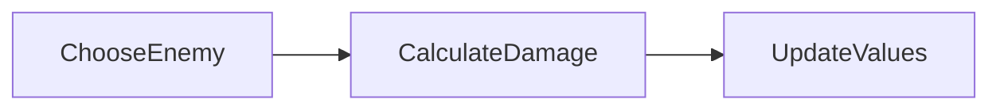
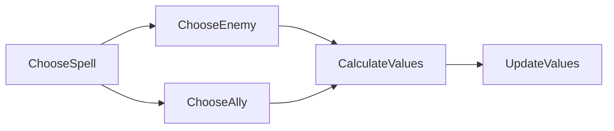

# Projeto Introdução à Computação 2022/2023

## Introdução 
Todos os grupos devem implementar em Python um sistema de combate por turnos no estilo clássico *Dungeons & Dragons* com as mecânicas descritas abaixo. O jogo irá usar apenas a linha de comandos e descrições de texto.

## Contexto do Jogo

O jogo *Dragon Adventure* segue um modelo clássico de jogos de *role-play* onde o jogador controla um grupo de aventureiros com uma serie de características diferentes (i.e. classes). A sua tarefa inicial será implementar um sistema de combate estratégico simples onde o jogador controla cada personagem do seu grupo de aventureiros contra os monstros do *feiticeiro demoníaco*. 

### Caracteristicas dos Personagens
Cada aventureiro ou monstro têm todas as mesmas caracteristicas base que inclui:
 - Nome: Simboliza o Nome do Personagem ou Monstro
 - Hit-Points (HP): Simboliza a quantidade de *vida* o personagem tem até ficar inconsciente
 - Mana-Points (MP): Simboliza o recurso utilizado para criar e lançar feitiços
 - Armor Points (AP): Simboliza a quantidade de dano que é subtraído após um ataque
 - Weapon (WP): Simboliza a quantidade de dano que este personagem faz após um ataque
 - Initiative (Init): Simboliza a rapidez que este personagem tem em fazer uma acção

### Fluxo do Combate
As mecânicas de combate seguem um sistema de rondas que se irá desenrolar até que um dos lados perder todos os personagens que tem sob o seu controlo, i.e. todos os personagens do jogador ou feiticeiro ficaram com o seu  ```HP <= 0 ```

Cada ronda consiste em duas fases:
 - Initiative Phase
 - Action Phase

### Initiative Phase
No início de cada ronda todos os personagens em jogo (i.e. ainda vivos) passam pelo processo de *iniciativa*, que consiste na formula seguinte:

``` TurnOrder = d20 + Init ``` 

onde o **TurnOrder** simboliza a que altura é que esse personagem actua na ronda corrente, **d20** simboliza o lançamento de um dado que varia entre [1, 20] e **Init** o valor de Initiative dessa personagem.

O personagem com o TurnOrder mais elevado é o que começa a ronda, seguido pelo segundo mais elevado e assim successivamente. Em caso de empate, o personagem com o Init maior passa à frente.

### Action Phase
Após terminar a fase de iniciativa, começa a fase de acção. Esta fase irá percorrer cada personagem seguindo a ordem definida no **TurnOrder**. O jogador toma controlo de cada aventureiro, enquanto o feiticeiro toma controlo de cada monstro.

Na sua vez cada personagem pode fazer uma de três acções:

 - Attack
 - Magic

#### Action: Attack
Esta acção simboliza um ataque a um personagem inimigo. Esta acção segue o seguinte fluxo:


 - **ChooseEnemy**: O jogador escolhe a personagem que quer atacar do lado inimigo
 - **CalculateDamage**: Calcula-se o dano utilizando esta formula: ``Dmg = MyWP - EnemyAP``, onde **Dmg** é o dano total efetuado pelo ataque, **MyWP** é o valor WP do personagem que está a atacar e **EnemyAP** é o valor AP do personagem que está a defender. 
**Nota**: Caso ``Dmg < 0`` este é atualizado para 0 (não pode haver valores de dano negativos). 
 - **UpdateValues**: Atualiza-se o HP do personagem que está a ser atacado usando a seguinte formula: ``EnemyHP = EnemyHP - Dmg``, onde EnemyHP é o total de HP do personagem que está a defender o ataque.
**Nota**: Caso ``EnemyHP <= 0`` o personagem cai inconsciente e sái imediatamente do combate e do jogo.

#### Action: Magic
Esta acção simboliza o uso de magia por parte de um personagem e segue o seguinte fluxo:



 - **ChooseSpell**: O jogador escolhe que feiticio irá lançar da lista de feitiços do personagem.
**Nota**: Um feitiço só pode ser escolhido através se ``MyMP >= SpellMPCost``, onde **MyMP** é o valor atual de MP do personagem, e **SpellMPCost** é o valor que custa lançar o feitiço escolhido. 
 - **ChooseEnemy/Ally**: O jogador escolhe um inimigo ou aliado para lançar o feitiço
 - **CalculateValues**: Calcula o valor de dano ou recuperação dependendo da formula especifica do feitiço (ver abaixo).
 - **UpdateValues**: Atualiza o HP do personagem que foi influenciado pelo feitiço usando a seguinte formula:
``ChosenHP = ChosenHP + SpellEffectValue``, onde **ChosenHP** é o valor de HP do personagem influenciado pelo feitiço, enquanto o **SpellEffectValue** é o valor calculado no ponto anterior. 
E atualiza o MP do personagem que lançou o feitiço usando a formula: ``MyMP = MyMP - SpellMPCost``

### Personagens (Jogador)
Esta secção descreve as caracteristicas de cada personagem para ser utilizado durante a implementação.

#### Warrior
 - HP: 32
 - MP: 5
 - AP: 2
 - WP: 5
 - Init: 2

##### Spells:

 - Rushdown (Apply on Enemy): 
	 - SpellEffectValue: ``SpellEffectValue = -1 * (WP + d4)``
	 - SpellMPCost: ``5``


#### Priest
- HP: 20
- MP: 25
- AP: 0
- WP: 2
- Init: 6

##### Spell:

 - Exorcism (Apply on Enemy):
	 - SpellEffectValue: ``SpellEffectValue = -1 * (d4 * 2)``
	 - SpellMPCost: ``5``
 - Mend (Apply on Ally):
	 - SpellEffectValue: ``SpellEffectvalue = d6 + WP``
	 - SpellMPCost: ``3``

### Personagens (Feiticeiro)
Os personagens do jogador feiticeiro só sabem atacar (não usam magia) por isso facilita a sua implementação (i.e. não é preciso IA). No entanto seguem a seguinte caracteristica:

#### Orc Warrior

 - HP: 15
 - MP: 0
 - AP: 2
 - WP: 2
 - Init: 2

 ## Interface
A interface é um dos aspectos mais importantes de qualquer jogo, permite ao jogador jogar o jogo e saber o que se passa e o que aconteceu *por exemplo os calculos de combate*. 

Durante o jogo é importante realçar informações chave para saber o que se passa e oferecer ao jogador informação suficiente para planear a sua próxima jogada. Considerando que este projeto irá usar a linha de comandos é importante considerar este aspeto antes de começar a fazer a implementação!

No fim de contas o jogo tem que estar jogável!

## Objetivos e Critério de Avaliação

Este projeto tem os seguintes objetivos:

-   **O1** - Programa deve funcionar como especificado. Atenção aos detalhes, pois é fácil desviarem-se das especificações caso não **leiam o enunciado com atenção**.
-   **O2** - Projeto e código bem organizados, nomeadamente:
    -   Código devidamente comentado e indentado.
    -   Inexistência de código "morto", que não faz nada, como por exemplo variáveis, propriedades ou métodos nunca usados.
    -   Projeto compila e executa sem erros e/ou _warnings_.
-   **O3** - Projeto adequadamente documentado com *comentários* descrevendo a funcionalidade de várias secções do código.
-   **O4** - Repositório Git deve refletir boa utilização do mesmo, nomeadamente:
    -   Devem existir _commits_ de todos os elementos do grupo, _commits_ esses com mensagens que sigam as melhores práticas para o efeito (como indicado [aqui](https://chris.beams.io/posts/git-commit/), [aqui](https://gist.github.com/robertpainsi/b632364184e70900af4ab688decf6f53), [aqui](https://github.com/erlang/otp/wiki/writing-good-commit-messages) e [aqui](https://stackoverflow.com/questions/2290016/git-commit-messages-50-72-formatting)).
    -   Ficheiros binários não necessários, não devem estar no repositório. Ou seja, devem ser ignorados ao nível do ficheiro `.gitignore`.
-   **O5** - Relatório em formato [Markdown](https://guides.github.com/features/mastering-markdown/) (ficheiro `README.md`), organizado da seguinte forma:
    -   Título do projeto.
    -   Autoria:
        -   Nome dos autores (primeiro e último) e respetivos números de aluno.
        -   Informação de quem fez o quê no projeto. Esta informação é **obrigatória** e deve refletir os _commits_ feitos no Git.
        -   Indicação do repositório Git utilizado. Esta indicação é opcional, pois podem preferir manter o repositório privado após a entrega.
    -   Arquitetura da solução:
        -   Descrição da solução, com breve explicação de como o código foi organizado, bem como dos algoritmos não triviais que tenham sido implementados.
        -   Um Fluxograma da vossa aplicação.
    -   Referências, incluindo trocas de ideias com colegas, código aberto reutilizado (e.g., do StackOverflow) e bibliotecas de terceiros utilizadas. Devem ser o mais detalhados possível.
    -   **Nota:** o relatório deve ser simples e breve, com informação mínima e suficiente para que seja possível ter uma boa ideia do que foi feito. Atenção aos erros ortográficos e à correta formatação [Markdown](https://guides.github.com/features/mastering-markdown/), pois ambos serão tidos em conta na nota final.

O projeto tem um peso de 10 valores na nota final da disciplina e será avaliado de forma qualitativa. Isto significa que todos os objetivos têm de ser parcialmente ou totalmente cumpridos. A cada objetivo, O1 a O5, será atribuída uma nota entre 0 e 1. A nota do projeto será dada pela seguinte fórmula:

_N = 10 x O1 x O2 x O3 x O4 x O5 x D_

Em que _D_ corresponde à nota da discussão e percentagem equitativa de realização do projeto, também entre 0 e 1. Isto significa que se os alunos ignorarem completamente um dos objetivos, não tenham feito nada no projeto ou não comparecerem na discussão, a nota final será zero.

### Desafios do Projeto

 - Sistemas de Logica, Aritmética e Relacional
 - Variaveis e Estrutura de Dados
 - O Fluxo de um Jogo
 - Utilização do Git
 - Documentação
 - Sensibilidade e Boas Práticas de Interação com o Utilizador
 - Python - Os Primeiros Passos

### Requisito Mínimo do Projeto

O requisito minimo do projeto é implementar o sistema de combate descrito (com interação e resposta do sistema) com as duas personagens do jogador (Warrior + Priest) e no minimo 4 inimigos (i.e. 4 x Orc Warrios). 

### Pontuação Extra

**Importante**: Façam o minimo requerido primeiro antes de tentarem fazer mais funcionalidades!!!

Os alunos que vão para além do expectavel irão receber valores extra e isto inclui:
 - Sensibilidade para a usabilidade entre Jogador e Jogo
 - Implementação de mais personagens
 - Implementação de mais variabilidade de inimigos
 - Implementação de Sistema de Magia para Inimigos
 - Implementação de mais Feitiços
 - Implementação de mais mecânicas de combate (e.g. Defend, Damage over Time, etc.).

### Text-based RPGs
O vosso jogo deve ter uma interface de texto, semelhante à dos tradicionais *text-based RPGs*. **Atenção:** Estes jogos são bastante mais complexos do que o projeto onde apenas vos é pedido para implementarem o sistema de combate.

#### [ZORK](http://textadventures.co.uk/games/view/5zyoqrsugeopel3ffhz_vq/zork)
"Many strange tales have been told of the fabulous treasure, exotic creatures, and diabolical puzzles in the Great Underground Empire. As an aspiring adventurer, you will undoubtedly want to locate these treasures and deposit them in your trophy case." - *Z-Files Catalog*


#### [Genesis](https://www.genesismud.org/play/)
"When most kids were playing Nintendo 8bit a few pioneer gamers already engaged in global guild wars on a pretty unknown place called The Internet." - *genesismud.org*


#### [Written Realms](https://writtenrealms.com)
"Build and play narrative adventure games. To play through a small introduction world, click the Play button above. Once you fight your way out of the cave, you will be taken to Edeus, the multiplayer world where more adventure awaits." - *WrittenRealms*


## Entrega
O projeto deve ser entregue por **grupos de 2 alunos** via Moodle até às **A DEFENIR**. Um (e apenas um) dos elementos do grupo deve ser submeter um ficheiro `zip` com a solução completa, nomeadamente:

-   Pasta escondida `.git` com o repositório Git local do projeto.
-   Pasta do projeto, contendo os ficheiros todos deste.
-   Ficheiro `README.md` contendo o relatório do projeto em formato [Markdown](https://guides.github.com/features/mastering-markdown/).
-   Ficheiro de imagem contendo o Fluxograma. Este ficheiro deve ser incluído no repositório em modo Git LFS.
-   Outros ficheiros de configuração, como por exemplo `.gitignore` e `.gitattributes`.

**Não serão avaliados projetos sem estes elementos e que não sejam entregues através do Moodle.**

## Honestidade académica
Nesta disciplina, espera-se que cada aluno siga os mais altos padrões de honestidade académica. Isto significa que cada ideia que não seja do aluno deve ser claramente indicada, com devida referência ao respectivo autor. O não cumprimento desta regra constitui plágio.

O plágio inclui a utilização de ideias, código ou conjuntos de soluções de outros alunos ou indivíduos, ou quaisquer outras fontes para além dos textos de apoio à disciplina, sem dar o respectivo crédito a essas fontes. Os alunos são encorajados a discutir os problemas com outros alunos e devem mencionar essa discussão quando submetem os projetos. Essa menção **não** influenciará a nota. Os alunos não deverão, no entanto, copiar códigos, documentação e relatórios de outros alunos, ou dar os seus próprios códigos, documentação e relatórios a outros em qualquer circunstância. De facto, não devem sequer deixar códigos, documentação e relatórios em computadores de uso partilhado, e muito menos usar repositórios Git públicos (embora os mesmos possam ser tornados públicos 12h após a data limite de submissão).

Nesta disciplina, a desonestidade académica é considerada fraude, com todas as consequências legais que daí advêm. Qualquer fraude terá como consequência imediata a anulação dos projetos de todos os alunos envolvidos (incluindo os que possibilitaram a ocorrência). Qualquer suspeita de desonestidade académica será relatada aos órgãos superiores da escola para possível instauração de um processo disciplinar. Este poderá resultar em reprovação à disciplina, reprovação de ano ou mesmo suspensão temporária ou definitiva da ULHT.

_Texto adaptado da disciplina de [Algoritmos e Estruturas de Dados](https://fenix.tecnico.ulisboa.pt/disciplinas/AED-2/2009-2010/2-semestre/honestidade-academica) do [Instituto Superior Técnico](https://tecnico.ulisboa.pt/pt/)_

## Licenças
Este enunciado é disponibilizado através da licença [CC BY-NC-SA 4.0](https://creativecommons.org/licenses/by-nc-sa/4.0/).

## Metadados
-   Autores: [Phil Lopes](https://github.com/worshipcookies) e [Ana Pinha](https://github.com/ajpessoa)
-   Curso: [Licenciatura em Videojogos](https://www.ulusofona.pt/licenciatura/videojogos)
-   Instituição: [Universidade Lusófona de Humanidades e Tecnologias](https://www.ulusofona.pt/)

